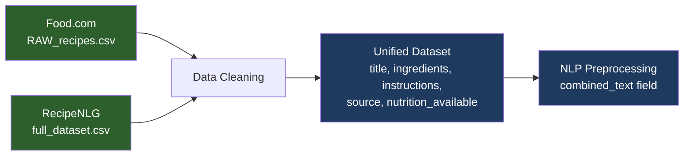
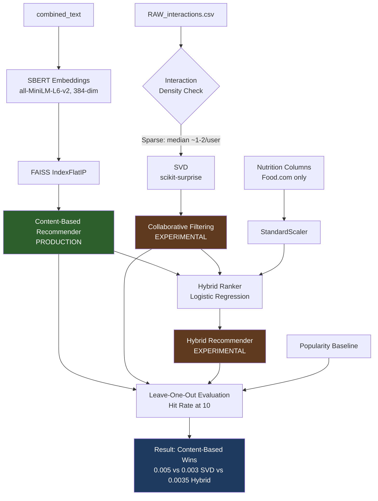
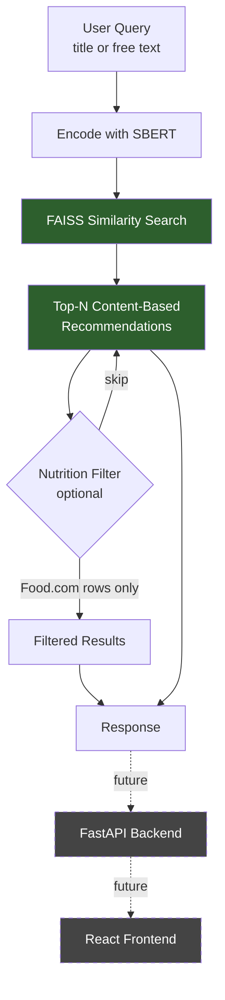

# 🍽️ Recipe Recommendation System

A **content-based recipe recommendation system** using semantic search (Sentence-BERT + FAISS), with an experimentally evaluated collaborative filtering and hybrid ranking layer. Built on Food.com and RecipeNLG datasets.

**Honest status note:** the system was originally designed as a full hybrid (content + collaborative + learned ranker). All three components were built and rigorously evaluated with a leakage-free leave-one-out protocol. The result: content-based search meaningfully outperforms collaborative filtering and the hybrid ranker on this dataset, because the underlying interaction data is too sparse (median ~1-2 ratings/user) for collaborative filtering to generalize. **Content-based is the production recommender; SVD and the hybrid ranker are included as documented, evaluated experiments**, not because they won, but because that's what the data actually showed.

---

## 🚀 Features

- 🔍 Semantic recipe search using Sentence-BERT (all-MiniLM-L6-v2)
- 🥗 Ingredient- and title-based recipe recommendations via FAISS similarity search
- 🍱 Nutrition-aware filtering (Food.com subset only — RecipeNLG has no nutrition data)
- 🤝 Collaborative filtering (SVD) and a learned hybrid ranker, built and evaluated as experiments
- ⚡ Fast approximate/exact similarity search with FAISS (`IndexFlatIP`)
- 📈 Evaluated end-to-end against baselines (popularity, content, SVD, hybrid) — not just qualitative spot-checks
- 🌐 FastAPI backend (in progress)
- 💻 React frontend (planned)

---

## 📂 Datasets

### Food.com Dataset
- Recipe metadata, ingredients, cooking instructions
- Nutrition facts (`nutrition` field: calories + 6 %DV fields)
- `RAW_interactions.csv`: user ratings/reviews, used for collaborative filtering

### RecipeNLG Dataset
- Large-scale recipe corpus, diverse cuisines
- Pre-parsed ingredient list (`NER` field) used as the canonical ingredient field for this source
- **No nutrition data, no user interactions** — this asymmetry is tracked explicitly via a `nutrition_available` flag rather than imputed or dropped

Both datasets are cleaned independently, then merged into a unified schema (`title`, `ingredients`, `instructions`, `description`, `source`, `nutrition_available`, nutrition columns) before any modeling.

---

## 🏗️ Dataset Pipeline



**Note:** RecipeNLG has no nutrition or interaction data — this asymmetry is tracked via a `nutrition_available` flag rather than dropped or fabricated.

---

## 🤖 Machine Learning Workflow



**LightFM was the original plan** for collaborative filtering (with SBERT embeddings as item features) — its build broke on Python 3.12/Windows and the upstream package is unmaintained. Pivoted to `scikit-surprise` SVD after a timeboxed attempt.

---

## 🧠 System Architecture (What's Actually Shipped)



SVD and the hybrid ranker are **not** in this serving path — they're documented experiments (notebooks 05/06), evaluated in notebook 07, and available in `models/` if you want to revisit collaborative filtering later with denser interaction data.

---

## 🔬 What Was Actually Built (Pipeline)

1. **Data cleaning** — parse stringified list columns (`ast.literal_eval`), drop broken rows, expand nutrition into named columns.
2. **Merge** — unify schema across both sources, dedupe by title, preserve original Food.com `id` for later interaction joins.
3. **NLP preprocessing** — combine title + ingredients + description + instructions into one text field; validated token length against MiniLM's 256-token limit before committing to it (<15% of recipes exceeded it).
4. **Feature engineering** — SBERT embeddings (384-dim, L2-normalized), nutrition scaling (`StandardScaler`, Food.com rows only), FAISS `IndexFlatIP` index.
5. **Content-based recommender** — FAISS similarity search by title or free-text query. Validated qualitatively (sensible top-k neighbors) and quantitatively (Hit Rate@10).
6. **Collaborative filtering** — originally planned as LightFM (with SBERT embeddings as item features); LightFM's build was broken on Python 3.12/Windows and unmaintained upstream, so pivoted to `scikit-surprise`'s SVD after a timeboxed attempt. Interaction density was checked *before* building this (sparsity confirmed: median ~1-2 interactions/user).
7. **Hybrid ranker** — logistic regression combining content similarity, SVD predicted rating, and a Bayesian-adjusted popularity score. Learned, not hand-weighted.
8. **End-to-end evaluation** — leave-one-out protocol, Hit Rate@10, four systems compared on identical held-out users. Caught and fixed two real bugs during this process: SVD train/test leakage (model was scoring on data it had already seen) and a candidate-pool bug that force-injected the correct answer into SVD/hybrid's search space. Both are documented in the eval notebook.

### Evaluation Results (Hit Rate@10, leave-one-out, 2,000 held-out users)

| System | Hit Rate@10 |
|---|---|
| Popularity (baseline) | 0.0020 |
| **Content-based (SBERT + FAISS)** | **0.0050** |
| SVD (collaborative) | 0.0030 |
| Hybrid ranker | 0.0035 |

Content-based wins outright — 2.5x the popularity baseline, and ahead of both collaborative approaches. Absolute numbers look small because this is a strict "did we guess the one held-out item out of ~44,000 candidates" test; what matters is the relative ranking between systems, not the raw percentage.

---

## 🛠️ Tech Stack

### Backend
- Python, FastAPI, Uvicorn

### Machine Learning
- Sentence Transformers (`all-MiniLM-L6-v2`)
- FAISS (`faiss-cpu`)
- scikit-learn (`StandardScaler`, `LogisticRegression`)
- scikit-surprise (`SVD`) — LightFM was the original plan; abandoned after build failures on Python 3.12/Windows

### Data Processing
- Pandas, NumPy, PyArrow (Parquet I/O for list-typed columns)

### Database
- PostgreSQL / SQLite (planned, for serving)

### Frontend
- React, TypeScript, Tailwind CSS (planned)

---

## 📁 Project Structure

```text
Recipe-Recommendation/
│
├── backend/
│   ├── datasets/
│   │   ├── RAW_recipes.csv
│   │   ├── RAW_interactions.csv
│   │   ├── full_dataset.csv
│   │   ├── processed/          # unified/preprocessed/feature-engineered parquet files
│   │   └── embeddings/         # sbert_embeddings.npy, faiss_index.bin
│   ├── models/                 # nutrition_scaler.pkl, svd_model.pkl, hybrid_ranker.pkl
│   ├── notebooks/
│   │   ├── 01_data_cleaning.ipynb
│   │   ├── 02_nlp_preprocessing.ipynb
│   │   ├── 03_feature_engineering.ipynb
│   │   ├── 04_recommenders.ipynb
│   │   ├── 05_collaborative_filtering.ipynb
│   │   ├── 06_hybrid_ranker.ipynb
│   │   └── 07_evaluation.ipynb
│   ├── results/
│   │   └── evaluation_results.csv
│   ├── app/                    # FastAPI backend — in progress
│   ├── requirements.txt
│   └── main.py
│
├── frontend/                   # planned
└── README.md
```

---

## 📊 Models — What's Actually In Each Category

### Content-Based (production)
- Sentence-BERT (`all-MiniLM-L6-v2`) embeddings
- FAISS `IndexFlatIP` (exact cosine similarity via L2-normalized inner product)

### Collaborative (experimental — evaluated, not shipped as primary)
- SVD (`scikit-surprise`) — RMSE 1.22, MAE 0.75 on a leakage-free split; Hit Rate@10 of 0.003, only marginally above the popularity baseline

### Hybrid Ranker (experimental — evaluated, not shipped as primary)
- Logistic regression over content similarity + SVD prediction + popularity score
- Did not outperform content-based alone once evaluation leakage was fixed

### Not built (removed from this README vs. earlier draft)
- TF-IDF was considered and deliberately dropped in favor of SBERT alone — redundant lexical signal on top of a semantic embedding, no clear justification kept.
- XGBoost learning-to-rank was in the original design; the hybrid ranker uses logistic regression instead (simpler, interpretable coefficients, sufficient given the ranker's modest feature count).

---

## 🎯 Future Improvements

- FastAPI backend wiring to serve the saved content-based recommender
- Revisit LightFM on a Python 3.10/3.11 environment (Docker) if collaborative filtering is worth another attempt
- Meal planner, grocery list generation, ingredient substitution
- LLM-powered recipe assistant
- Mobile application
- Docker deployment

---

## 📄 License

This project is intended for educational and research purposes.
